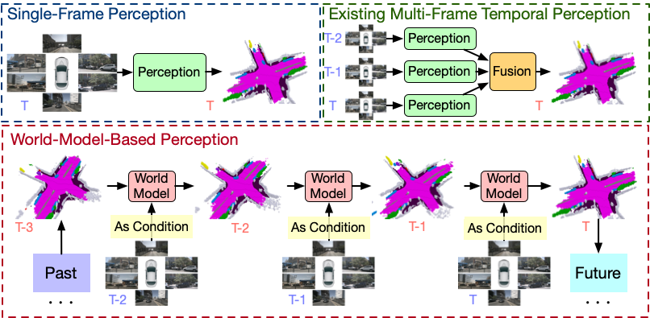
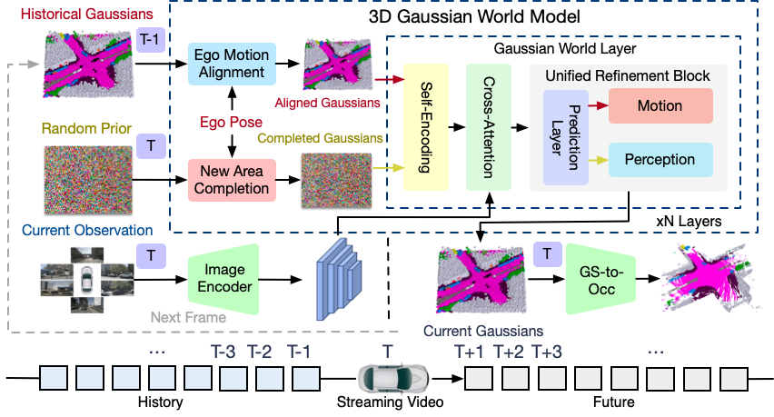

# GaussianWorld: Gaussian World Model for Streaming 3D Occupancy Prediction

> GaussianWorld: Gaussian World Model for Streaming 3D Occupancy Prediction

> [Sicheng Zuo](https://scholar.google.com/citations?user=11kh6C4AAAAJ&hl=en&oi=ao), [Wenzhao Zheng](https://wzzheng.net/)$\dagger$,  [Yuanhui Huang](https://scholar.google.com/citations?hl=zh-CN&user=LKVgsk4AAAAJ), [Jie Zhou](https://scholar.google.com/citations?user=6a79aPwAAAAJ&hl=en&authuser=1), [Jiwen Lu](http://ivg.au.tsinghua.edu.cn/Jiwen_Lu/)

$\dagger$ Project leader

GaussianWorld reformulates 3D occupancy prediction as a 4D occupancy forecasting problem conditioned on the current sensor input and propose a **Gaussian World Model** to exploit the scene evolution for perception.

## Overview
To exploit the scene evolution for perception, we reformulate the 3D occupancy prediction as a 4D occupancy forecasting problem conditioned on the current visual input.
We propose a Gaussian World Model (GaussianWorld) to explicitly exploit the scene evolution in the 3D Gaussian space and predict 3D occupancy in a streaming manner.
Our GaussianWorld demonstrates state-of-the-art performance compared to existing methods without introducing additional computation overhead.

Code will be released soon.